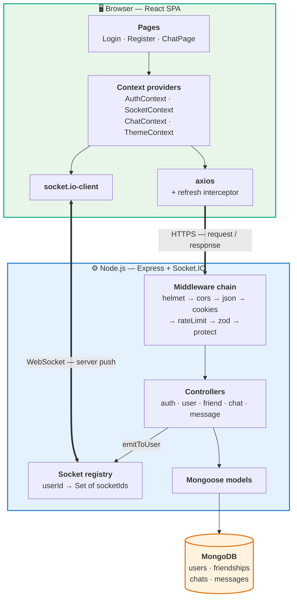
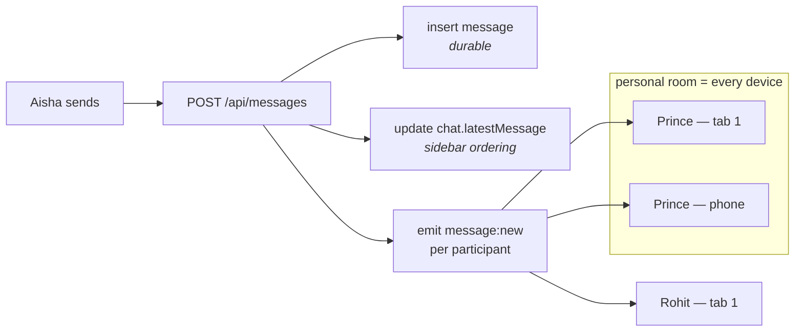
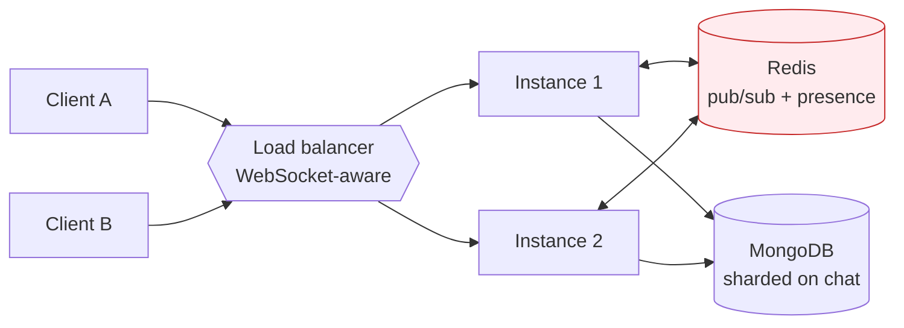

# Architecture & System Design

How ChatApp is put together, why each choice was made, and what would have to
change to run it at scale. Written to be defensible in a design interview.

> **Every flow in this document is drawn in [FLOWS.md](FLOWS.md)** — 15 sequence
> diagrams, state machines and flowcharts covering auth, friend requests,
> message delivery, presence, pagination and deployment.
> Deployment steps live in [DEPLOYMENT.md](DEPLOYMENT.md).

---

## Contents

1. [Requirements](#1-requirements)
2. [High-level architecture](#2-high-level-architecture)
3. [Request vs. realtime paths](#3-request-vs-realtime-paths)
4. [Data model](#4-data-model)
5. [Indexing strategy](#5-indexing-strategy)
6. [Authentication design](#6-authentication-design)
7. [The friendship model](#7-the-friendship-model)
8. [Message delivery & receipts](#8-message-delivery--receipts)
9. [Pagination](#9-pagination)
10. [Presence](#10-presence)
11. [Consistency & failure handling](#11-consistency--failure-handling)
12. [Scaling beyond one process](#12-scaling-beyond-one-process)
13. [Security posture](#13-security-posture)
14. [Trade-offs I would defend](#14-trade-offs-i-would-defend)

---

## 1. Requirements

### Functional
- Register, log in, stay logged in across reloads
- Find people and manage friend requests
- Message only confirmed friends, 1:1 or in groups
- See messages arrive without refreshing
- See typing, presence, and whether a message was delivered and read
- Scroll back through history

### Non-functional
- **Latency:** a message should appear on the recipient's screen in well under a
  second on a normal connection.
- **Ordering:** messages in a conversation must render in a stable order.
- **Durability:** an acknowledged message must not be lost.
- **Idempotency:** a retried send must not create a duplicate.
- **Least privilege:** a user must not read a conversation they are not in.

### Explicit non-goals
End-to-end encryption, voice/video, media uploads, message search,
multi-region deployment. Each is called out in
[§14](#14-trade-offs-i-would-defend) with the reasoning.

### Rough scale target
This is designed and reasoned about at roughly **10k registered users, ~1k
concurrent sockets, ~50 messages/second peak** — comfortably one process. The
scaling section describes what breaks first past that.

---

## 2. High-level architecture



The controllers are the only layer that talks to both the database and the
socket registry. That is deliberate: a write and the push that announces it
happen in one place, so they cannot drift apart.

---

## 3. Request vs. realtime paths

Two transports, each doing what it is good at:

| | REST (axios) | WebSocket (Socket.IO) |
|---|---|---|
| Direction | client → server | server → client (mostly) |
| Used for | login, history, sending, friend actions | new messages, receipts, presence, typing |
| Guarantee | request/response, retryable | fire-and-forget |
| If it fails | axios retries after refresh | client reconnects and refetches |

**Why send messages over REST rather than the socket?** The write needs a
response the client can act on — the persisted `_id`, `createdAt`, and the
populated sender. Doing that over a socket means inventing a request/response
correlation layer that HTTP already has, plus retries, status codes and
idempotency. The socket is used for what HTTP is bad at: pushing to *other*
people.

**The critical consequence:** the socket is a *notification* channel, not the
source of truth. A missed event is never fatal — reconnecting and refetching
restores correctness. That is what makes the system tolerant of flaky networks.

---

## 4. Data model

Four collections.

### `users`
```js
{
  _id, name, username (unique), email (unique),
  password,              // bcrypt hash, select:false
  avatar, about,
  friends: [ObjectId],   // denormalised, see §7
  blocked: [ObjectId],
  isOnline, lastSeen,
  createdAt, updatedAt
}
```

### `friendships`
```js
{
  _id, requester, recipient,
  status,     // pending | accepted | rejected | blocked
  pairKey,    // "<smallerId>_<largerId>" — unique
  respondedAt, createdAt, updatedAt
}
```

### `chats`
```js
{
  _id, name, isGroupChat, avatar,
  users: [ObjectId], admins: [ObjectId],
  latestMessage: ObjectId,
  pairKey,    // set only for 1:1 chats; unique via a partial index
  createdAt, updatedAt
}
```

### `messages`
```js
{
  _id, chat, sender, content, type,
  replyTo,
  deliveredTo: [{ user, at }],
  readBy:      [{ user, at }],
  deletedFor: [ObjectId], isDeleted,
  clientId,   // idempotency key, unique per chat
  createdAt, updatedAt
}
```

### Why this shape

**Messages are their own collection, not an array inside `chats`.** Embedding
would be faster to read a whole conversation, but MongoDB caps a document at
16 MB, and an active chat blows past that. Worse, every new message would
rewrite a growing document. A separate collection with a compound index gives
O(log n) access to any page of any conversation, forever.

**Receipts are embedded in the message.** In a 1:1 chat `readBy` has at most two
entries; in a small group, a handful. Reading a message and knowing who has read
it is one document fetch with no join. This is the design's main scale ceiling —
in a 500-member group the array becomes the dominant cost, and receipts would
have to move to their own collection or be collapsed to a per-user
"last read message" pointer.

**`latestMessage` is denormalised onto `chats`.** The sidebar needs the last
message of every conversation. Without it, rendering the list is one query per
chat. With it, the list is a single query with one `populate`.

---

## 5. Indexing strategy

Indexes are where a chat app is won or lost. Each one here exists for a specific
query.

| Collection | Index | Serves |
|---|---|---|
| `messages` | `{chat: 1, createdAt: -1, _id: -1}` | **The hot path.** History, newest first, paginated |
| `messages` | `{chat: 1, clientId: 1}` unique, partial | Send idempotency |
| `chats` | `{users: 1, updatedAt: -1}` | The sidebar: my chats, most recent first |
| `chats` | `{pairKey: 1}` unique, partial | Exactly one 1:1 chat per pair |
| `friendships` | `{pairKey: 1}` unique | One relationship row per pair |
| `friendships` | `{recipient: 1, status: 1}` | Incoming pending requests |
| `friendships` | `{requester: 1, status: 1}` | Outgoing pending requests |
| `users` | `{email: 1}`, `{username: 1}` unique | Login, uniqueness |

**Why the message index is compound and ordered that way.** The query is always
"messages in *this* chat, newest first". Putting `chat` first makes it an
equality prefix that narrows to one conversation; `createdAt: -1` then means the
sort is *served by the index* — MongoDB walks it in order and stops after the
page size, with no in-memory sort. `_id: -1` is a tiebreaker for messages
created inside the same millisecond, which is what keeps ordering stable.

**Why the unique indexes are partial.** `pairKey` is `null` for group chats. A
plain unique index treats `null` as a value, so the *second* group chat ever
created would collide. `partialFilterExpression: {pairKey: {$type: "string"}}`
applies uniqueness only to documents that actually have one.

---

## 6. Authentication design

### The two-token scheme

| | Lifetime | Stored where | Readable by JS? |
|---|---|---|---|
| **Access token** | 15 minutes | JS variable (RAM) | yes — but dies on reload, so the window is short |
| **Refresh token** | 7 days | httpOnly cookie, `path=/api/auth` | no |

The two common single-token designs both have a bad failure mode:

- **JWT in `localStorage`** — any XSS reads it and exfiltrates a long-lived
  credential.
- **Long-lived session cookie only** — safe from XSS, but exposed to CSRF, and
  it does not fit a WebSocket handshake cleanly.

Splitting them narrows both. XSS can reach the access token, but it expires in
15 minutes and is gone on reload. The refresh token survives reloads but is
httpOnly, so script cannot read it, and it is scoped to `path=/api/auth` so it
is not even sent to normal API routes. CSRF is mitigated by `SameSite` plus the
fact that the refresh endpoint returns the access token in the *body* — a
cross-site form post cannot read the response.

### Single-flight refresh

If ten requests 401 at once, ten refresh calls would race, and with rotation
each would invalidate the others. The interceptor caches the in-flight refresh
promise so all ten await one call:

```js
refreshing = refreshing || api.post("/auth/refresh").finally(() => { refreshing = null; });
```

### Socket authentication

The token is passed in the Socket.IO handshake and verified in `io.use()`, so an
unauthenticated socket never exists and no event handler re-checks identity.
On reconnect the client re-reads the current token, because the original may
have expired during the outage.

**Why not a header?** The browser WebSocket API does not allow custom headers on
the upgrade request. `handshake.auth` is the transport-agnostic equivalent.

---

## 7. The friendship model

A friendship is symmetric, but a friend *request* is directional. That tension
drives the design.

**The `pairKey` trick.** Sorting the two ids and joining them gives an
order-independent identity: `A_B` and `B_A` both normalise to the same string.
A unique index on it makes "A and B can have at most one relationship"
a database invariant rather than something application code hopes to enforce.
Without it, A and B tapping "add friend" simultaneously creates two rows and the
UI shows a request that can never be resolved.

**Deliberate denormalisation.** `User.friends` duplicates what `friendships`
already says. The justification is the read/write ratio: the friend list is read
on every chat open, every group creation and every DM permission check, while it
changes only when someone accepts or removes a friend — orders of magnitude
less often. `friendships` stays the source of truth for *state*; `User.friends`
is a materialised view for the hot read.

The cost is a consistency risk: two writes that must not half-apply. That is why
accepting runs in a transaction where the deployment supports one:

```js
await session.withTransaction(async () => {
  request.status = "accepted";  await request.save({ session });
  await User.updateOne({_id: a}, {$addToSet: {friends: b}}, {session});
  await User.updateOne({_id: b}, {$addToSet: {friends: a}}, {session});
});
```

On a standalone `mongod` (no transactions) it falls back to sequential writes.
`$addToSet` is idempotent, so a retry after a partial failure converges rather
than duplicating.

**Mutual-request collapse.** If B sends a request to A when A has already sent
one to B, treating it as a second request would strand both. The code detects
the inverse pending request and accepts it — which is what the user meant.

---

## 8. Message delivery & receipts

### The tick model

| State | UI | Meaning |
|---|---|---|
| `sent` | ✓ | Persisted on the server |
| `delivered` | ✓✓ grey | Reached the recipient's device |
| `read` | ✓✓ blue | The recipient opened the chat |

`deliveredTo` is stamped at write time for every participant who currently has a
live socket. `readBy` is filled by `PUT /api/messages/:chatId/read` when the
recipient opens the conversation.

### Fan-out



Emitting to a **personal room per user** rather than a chat room is the key
decision. A chat room only reaches people with that conversation open; the
personal room reaches every device the user has connected, so the sidebar
updates and the unread badge increments even when the chat is closed.

### Optimistic send and idempotency

The client renders the bubble before the server replies, using a generated
`clientId`. If the request is retried, the unique `{chat, clientId}` index turns
the second insert into a duplicate-key error, which the controller catches and
answers with the original message:

```js
catch (err) {
  if (err.code === 11000 && clientId) {
    message = await Message.findOne({ chat: chatId, clientId });
  } else throw err;
}
```

Idempotency enforced by a database constraint rather than a read-then-write
check, which would itself be racy.

### Ordering

Messages are ordered by server `createdAt`, not client time — client clocks are
unreliable and trivially spoofed. Within the same millisecond, `_id` breaks the
tie; because ObjectIds embed a counter, that ordering is stable across reads.

---

## 9. Pagination

History uses **cursor (keyset) pagination**, not `skip`/`limit`.

```js
// skip: the server must walk and discard every skipped document
db.messages.find({chat}).sort({createdAt: -1}).skip(15000).limit(30)   // O(skip)

// cursor: seek straight into the index
db.messages.find({chat, createdAt: {$lt: cursor}}).sort({createdAt: -1}).limit(30)  // O(log n)
```

Two reasons this matters in a chat app specifically:

1. **`skip` degrades with depth.** Page 500 of a long conversation is
   dramatically slower than page 1, and scrolling back is exactly what users do.
2. **`skip` is incorrect under writes.** New messages arriving mid-scroll shift
   every offset, so the reader sees duplicates or gaps. A `createdAt` cursor is
   anchored to a fixed point and is unaffected.

The endpoint fetches `limit + 1` rows: the extra row is how it knows whether
another page exists, without a second `count` query.

---

## 10. Presence

```js
Map {
  "user_A" => Set { "socket_1", "socket_2" },   // laptop + phone
  "user_B" => Set { "socket_3" }
}
```

Presence is *derived* — "online" means the set is non-empty. A user with three
tabs is one online user, and closing one tab must not mark them offline. Only
the transition from the last socket to zero flips them offline and stamps
`lastSeen`.

Broadcasts go only to that user's friends, not to everyone. That keeps presence
fan-out proportional to the social graph rather than to total users online.

`isOnline`/`lastSeen` are also persisted so a user who has never been seen in
this process still shows a sensible "last seen".

---

## 11. Consistency & failure handling

| Failure | Behaviour |
|---|---|
| Access token expires mid-session | Interceptor refreshes once, retries transparently |
| Refresh token expires | User is logged out and routed to `/login` |
| Socket drops | Client reconnects with backoff; refetches on chat open |
| Message POST fails | Bubble marked failed; nothing is lost server-side |
| Message POST retried | Idempotency index returns the original message |
| Both users open a DM at once | `pairKey` unique index; one upsert wins |
| Both users send friend requests at once | `pairKey` unique index; mutual request collapses to accept |
| Partial write accepting a friendship | Transaction, or idempotent `$addToSet` retry |
| Unhandled promise rejection | Server closes the listener and exits for the supervisor to restart |

The general principle: **push is best-effort, persistence is authoritative.**
Any missed event is recoverable by refetching, so no correctness property
depends on a socket message arriving.

---

## 12. Scaling beyond one process

Today this runs as one Node process. Here is what breaks, in the order it breaks.

### First to break: the socket registry

The `Map` is per-process. With two instances behind a load balancer, a user on
instance A is invisible to instance B, so half the messages never get pushed.



Fix: `@socket.io/redis-adapter` so `emit` fans out across instances, and move
presence into Redis (`SADD presence:<userId> <socketId>` with a TTL heartbeat, so
a crashed instance's sockets expire instead of leaking as permanently "online").
Sticky sessions are also needed if HTTP long-polling fallback is enabled.

### Next: the database read path

`GET /api/chats` runs an aggregation for unread counts across all of a user's
chats. Fine at 20 chats, expensive at 500. Fix: keep a per-user unread counter
on the chat membership and increment it at write time, trading a little write
cost for a constant-time read.

### Then: message volume

The `messages` collection grows without bound. Options, in order of how far they
go: TTL indexes for ephemeral chats; archiving cold messages to object storage;
sharding on `chat` as the shard key — which keeps a conversation's history on
one shard so pagination stays a single-shard query, at the cost of a hot shard
for a very busy chat.

### Then: fan-out in large groups

Emitting per participant is linear in group size. A 10,000-member group means
10,000 emits per message. That is where you move to a room-based broadcast with
a separate lightweight path for badge updates, and where embedded read receipts
have to be redesigned.

### What I would add before any of that

Structured logging with request ids, health/readiness probes, metrics
(message latency p99, socket count, DB pool saturation), and an integration test
suite. Operability first — the scaling work is guesswork without it.

---

## 13. Security posture

| Concern | Mitigation |
|---|---|
| Password storage | bcrypt, cost 10, `select: false` on the field |
| User enumeration | Login returns one generic message for both failure modes |
| Brute force | 20 attempts / 15 min on auth routes; 300 req/min elsewhere |
| XSS token theft | Access token in memory only; refresh token httpOnly |
| CSRF | `SameSite` cookie, scoped `path`, token returned in the body |
| NoSQL injection | Zod parses and coerces every body before the controller |
| ReDoS in search | User input escaped before being used in a `RegExp` |
| IDOR | Every chat/message handler verifies participation, not just a valid token |
| Privilege escalation | Group mutations verify admin; only a recipient can accept a request |
| Header hardening | `helmet` |
| CORS | Explicit origin allow-list — required, since `credentials: true` forbids `*` |
| Payload size | `express.json({limit: "1mb"})` |
| Error leakage | Stack traces suppressed when `NODE_ENV=production` |

React escapes interpolated content by default, and the app never uses
`dangerouslySetInnerHTML`, so stored XSS via message content is not reachable.

---

## 14. Trade-offs I would defend

**Context instead of Redux.** Three providers with clear boundaries — auth,
socket, chat. Redux's value is time-travel debugging and middleware for complex
async graphs; neither pays for itself here. The real cost of Context is that any
value change re-renders all consumers, which is why the socket handlers read
`activeChat` through a ref instead of resubscribing on every switch. At a
larger scale I would reach for Zustand before Redux.

**MongoDB instead of PostgreSQL.** Messages are self-contained documents with a
variable shape (`replyTo`, receipt arrays, soft-delete lists), the access pattern
is overwhelmingly "give me the last N in this conversation", and there are no
multi-entity transactions in the hot path. Postgres would be the better answer
if the product needed strong relational integrity or complex ad-hoc queries —
and honestly, `friendships` *is* a relational table wearing a document costume.

**No E2E encryption.** It is the single biggest gap versus real WhatsApp, and it
is a deliberate omission rather than an oversight: the Signal protocol requires
per-device key management, prekey bundles and a re-think of multi-device sync,
and it makes server-side features like search structurally impossible. Worth
saying out loud in an interview rather than pretending the gap is not there.

**Soft delete over hard delete.** "Delete for everyone" keeps the row and blanks
the content. Removing it would break `replyTo` references and disturb the
ordering of loaded pages on other clients.

**Denormalised friends list.** Discussed in [§7](#7-the-friendship-model) — a
classic read-optimisation that buys speed with a consistency obligation. The
obligation is met with a transaction and idempotent writes.
