# Flow Diagrams

Every significant path through ChatApp, drawn. Diagrams are Mermaid, which
GitHub renders natively — no images to keep in sync with the code.

- [1. System architecture](#1-system-architecture)
- [2. Entity relationships](#2-entity-relationships)
- [3. Registration & login](#3-registration--login)
- [4. Silent session restore](#4-silent-session-restore)
- [5. Token refresh on 401](#5-token-refresh-on-401)
- [6. Friend request lifecycle](#6-friend-request-lifecycle)
- [7. Sending a friend request](#7-sending-a-friend-request)
- [8. Opening a 1:1 chat](#8-opening-a-11-chat)
- [9. Sending a message](#9-sending-a-message)
- [10. Message state machine](#10-message-state-machine)
- [11. Socket lifecycle & presence](#11-socket-lifecycle--presence)
- [12. Typing indicator](#12-typing-indicator)
- [13. Loading older messages](#13-loading-older-messages)
- [14. Request middleware pipeline](#14-request-middleware-pipeline)
- [15. Deployment topology](#15-deployment-topology)

---

## 1. System architecture

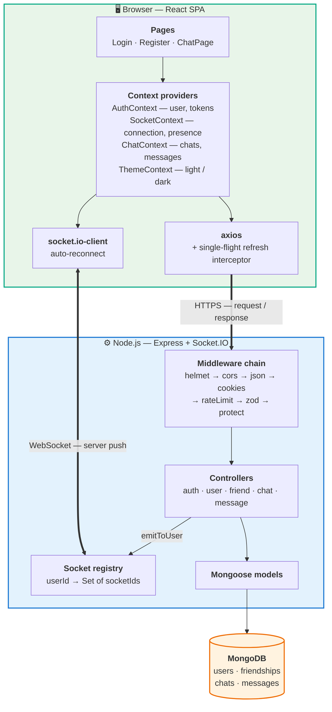

The controllers are the only layer touching both the database and the socket
registry. That is deliberate: a write and the push announcing it happen in one
place, so they cannot drift apart.

---

## 2. Entity relationships

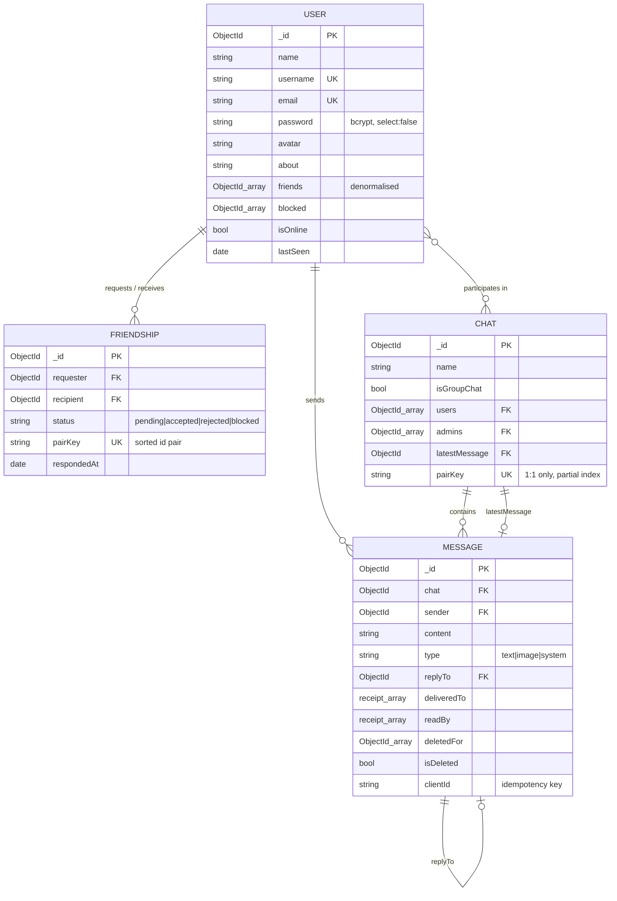

---

## 3. Registration & login

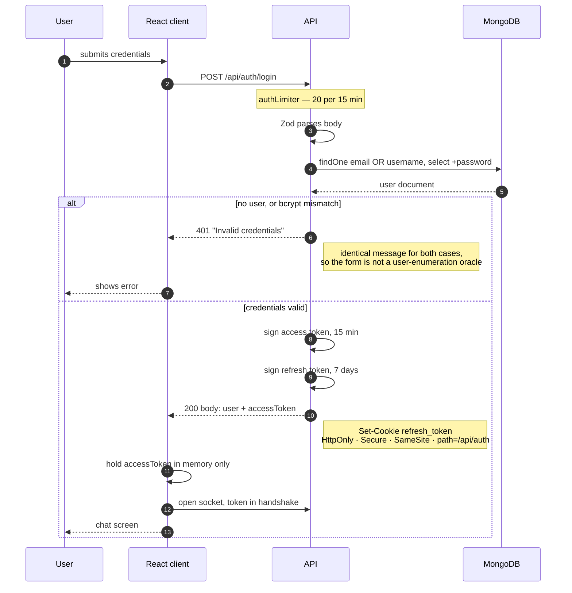

The access token is returned in the **body** and kept in a JS variable; the
refresh token is set as an httpOnly cookie the client can never read.

---

## 4. Silent session restore

What happens on a hard refresh, when the in-memory access token is gone but the
refresh cookie survives.

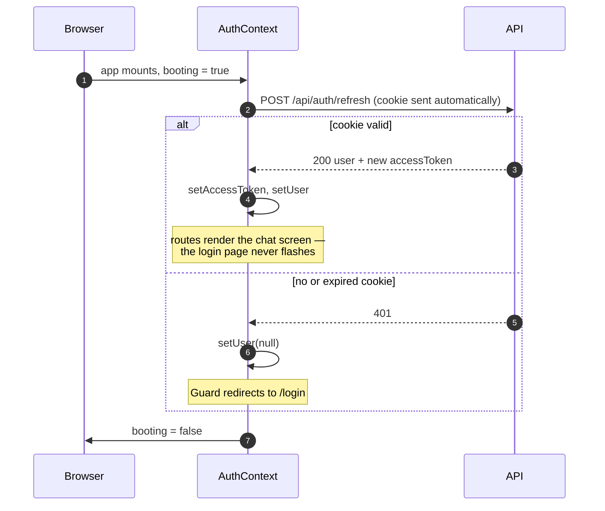

The `booting` flag exists so the route guard shows a splash instead of briefly
redirecting a logged-in user to `/login`.

---

## 5. Token refresh on 401

The single-flight problem: several requests fail at once, but only one refresh
must happen.

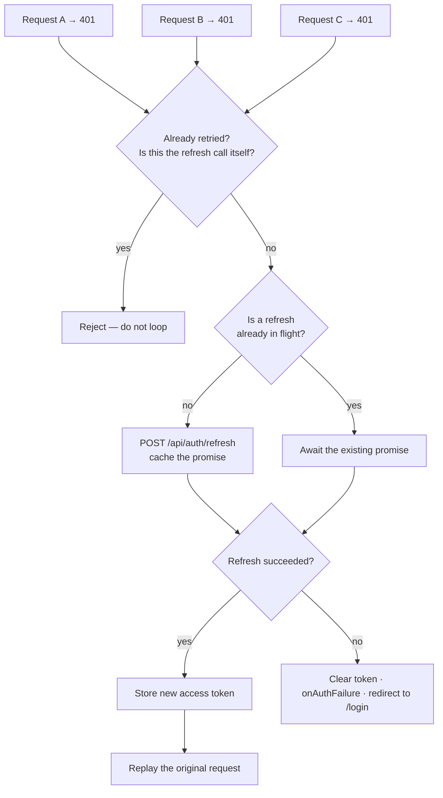

Without the single-flight cache, ten concurrent 401s fire ten refresh calls;
because refresh **rotates** the token, they invalidate each other and the user is
logged out for no reason.

---

## 6. Friend request lifecycle

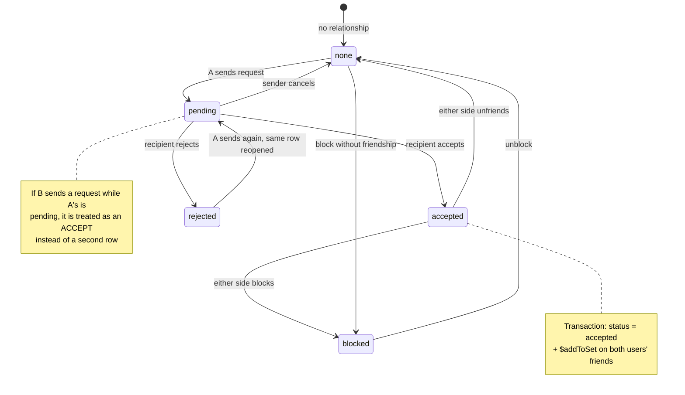

Only the **recipient** may accept or reject; only the **sender** may cancel.
Both are enforced server-side and verified with negative tests.

---

## 7. Sending a friend request

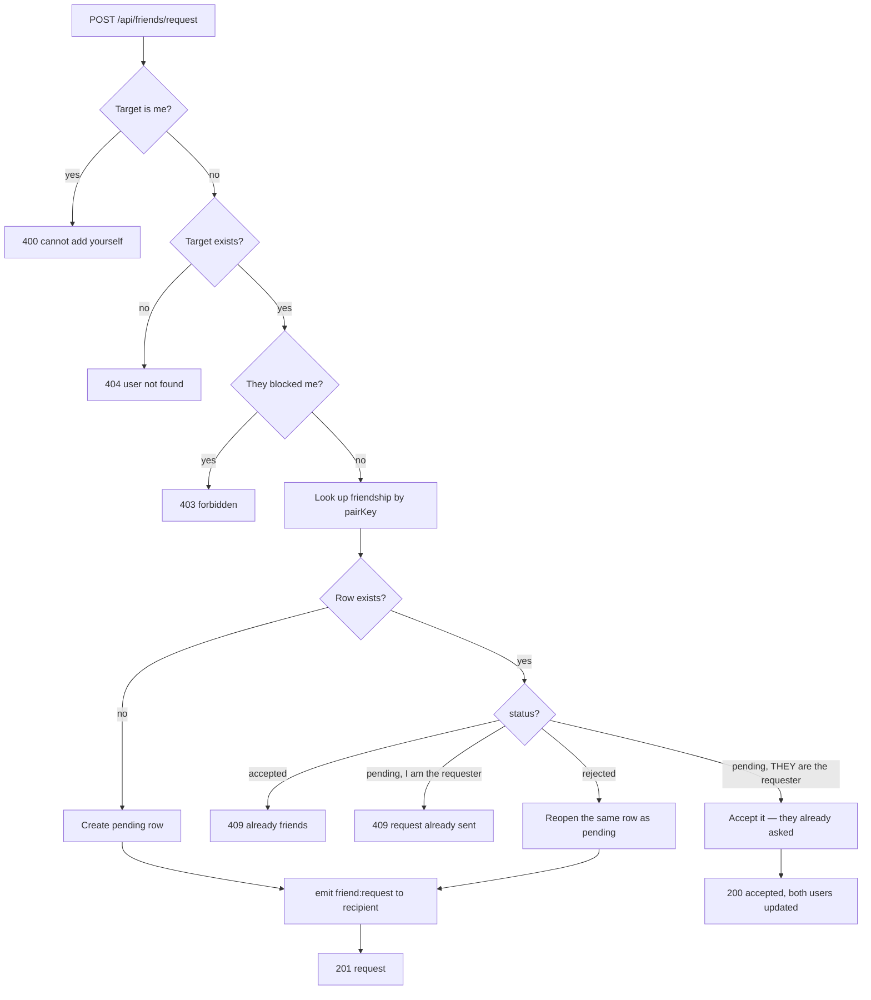

---

## 8. Opening a 1:1 chat

The race that a naive implementation loses.

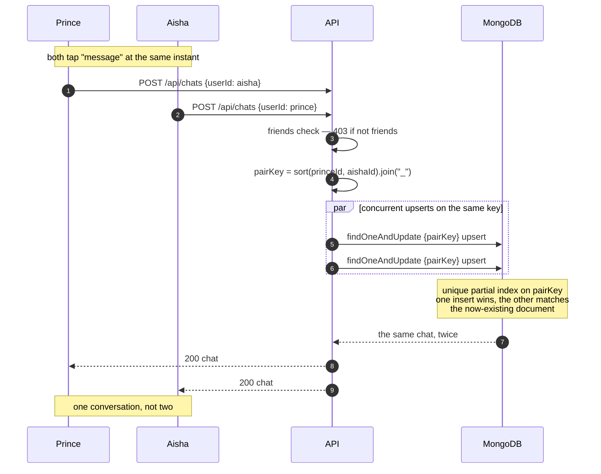

`findOne`-then-`create` would let both requests find nothing and both create,
splitting the history across two chats. The uniqueness constraint is the only
non-racy fix — an application-level check is a read-then-write.

---

## 9. Sending a message

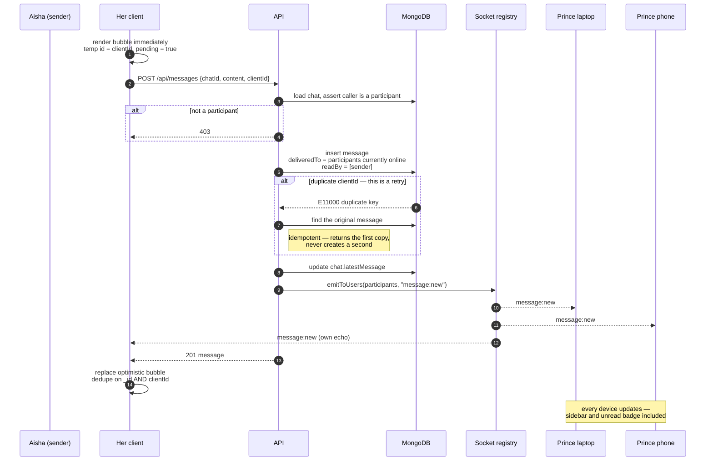

Emitting to a room **per user** rather than per chat is what makes the phone
update even with the conversation closed.

---

## 10. Message state machine

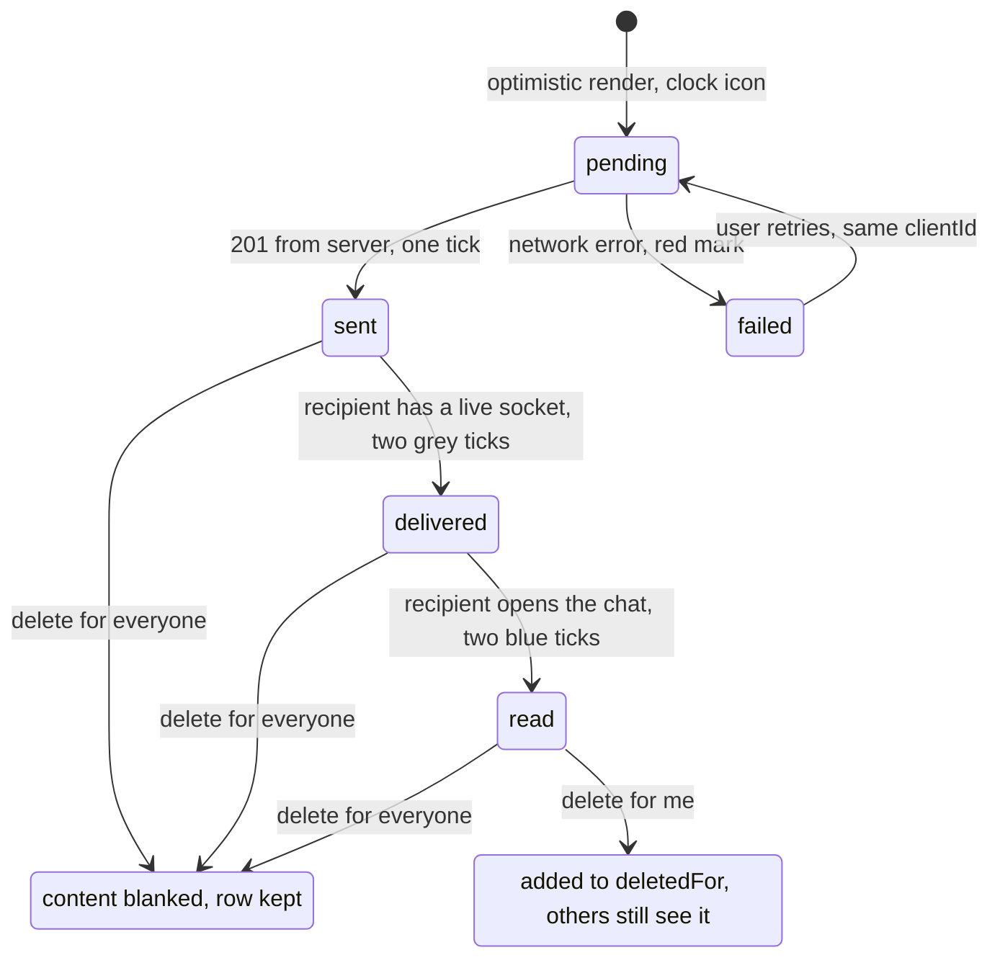

The row survives a "delete for everyone" because `replyTo` references point at
it and removing it would disturb pages already loaded on other clients.

---

## 11. Socket lifecycle & presence

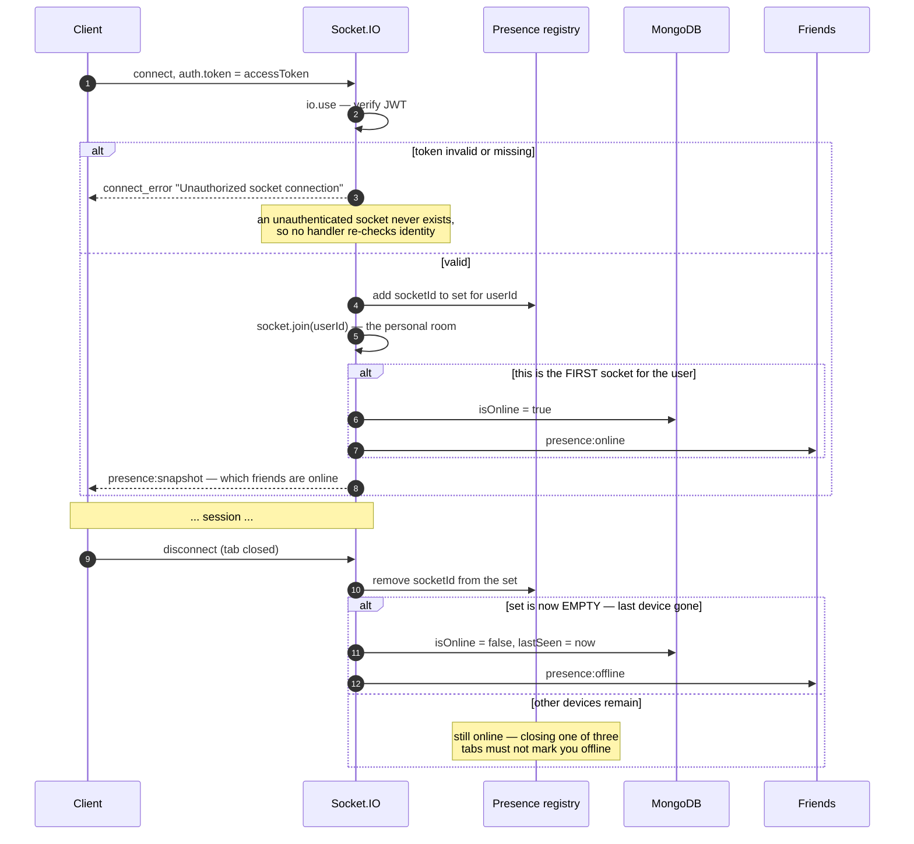

---

## 12. Typing indicator

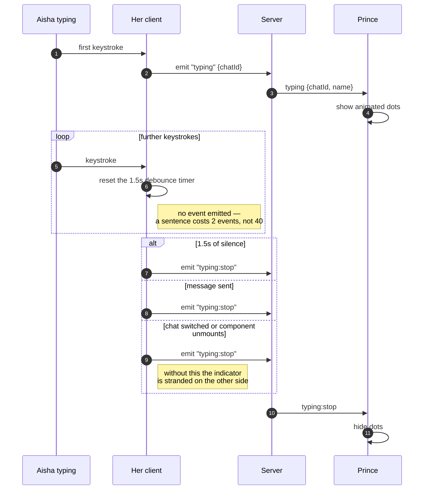

---

## 13. Loading older messages

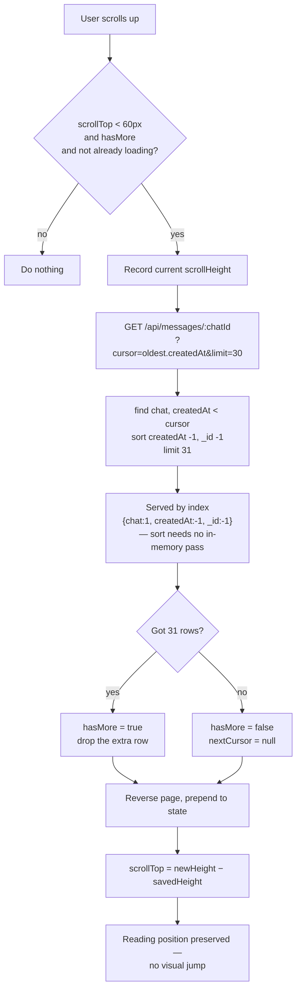

The 31st row is how the endpoint knows another page exists without a second
`count` query.

---

## 14. Request middleware pipeline

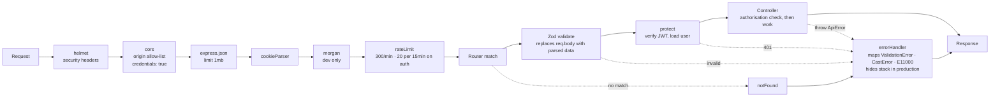

Zod runs **before** `protect` on public routes and before the controller
everywhere, so no operator object like `{"$ne": null}` can ever reach a query.

---

## 15. Deployment topology

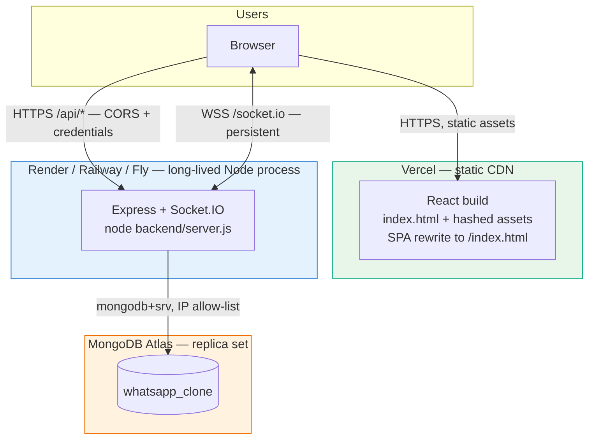

**Why the API is not on Vercel.** Vercel runs serverless functions: short-lived,
stateless, no persistent connection. A WebSocket has to stay open, and the
presence registry is in-process memory. Both are incompatible with that model,
so the API needs a host that keeps a process alive. See
[DEPLOYMENT.md](DEPLOYMENT.md) for the full reasoning and the alternatives.
